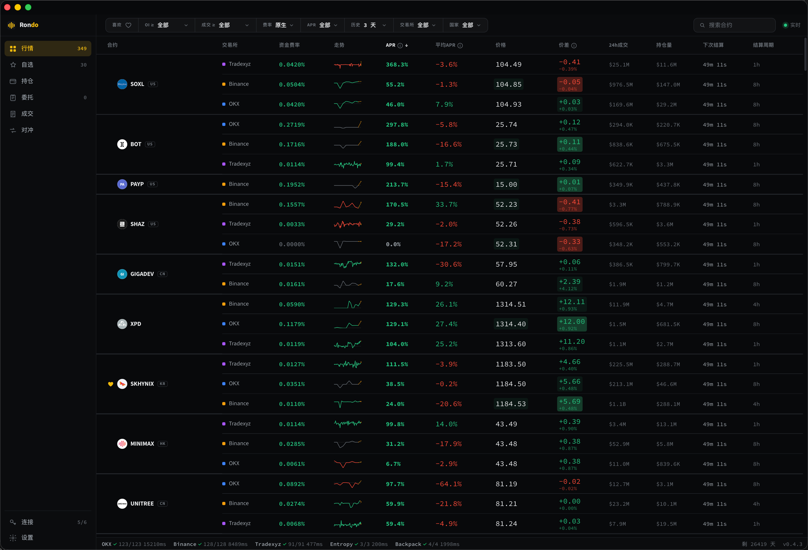
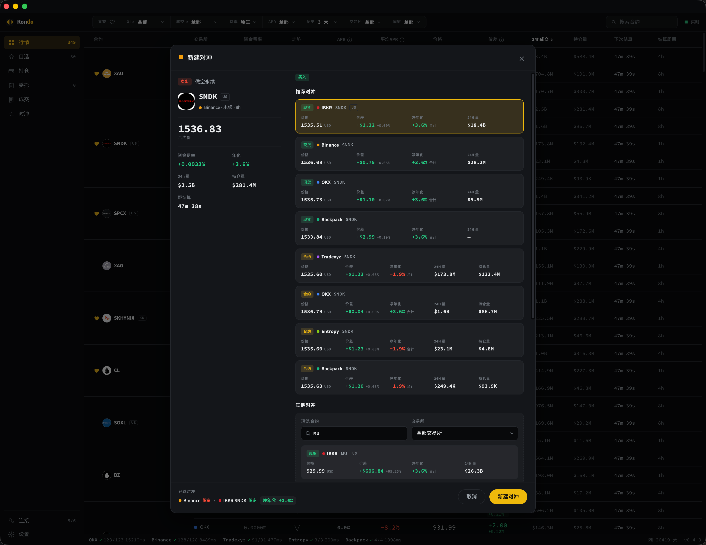
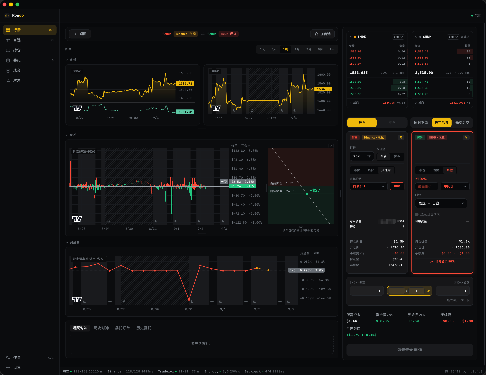
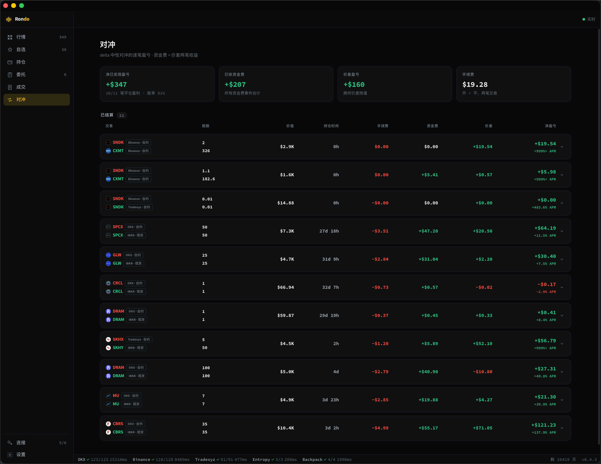
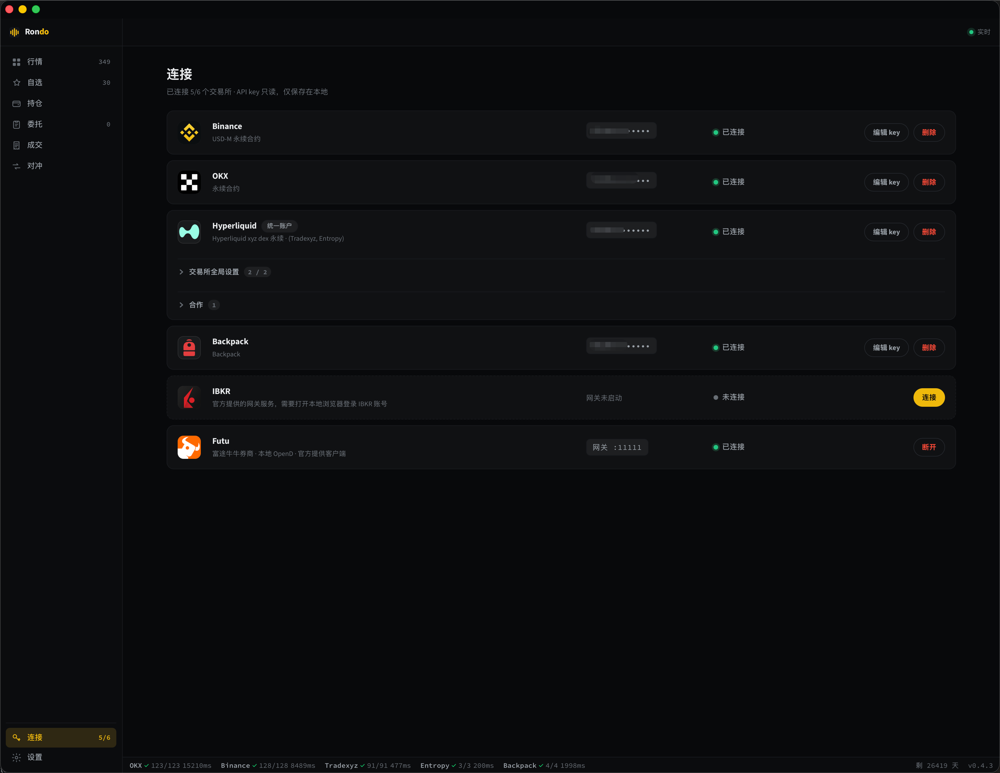

# Rondo Desktop

## 截图

### 行情

跨交易所永续合约的资金费率、APR、价差、成交量与持仓量，一屏对比。

### 新建对冲

选中一条永续合约后，自动列出可对冲的现货 / 合约腿，并给出各腿的价差与净年化。

### 对冲详情

两腿价格、价差、资金费走势图，双边盘口与开平仓下单面板。

### 对冲收益

delta 中性对冲的逐笔盈亏拆分：资金费、价差、手续费。

### 连接

交易所 API key 与 IBKR / 富途本地网关的连接管理。

## IBKR 使用说明

- IBKR 对登录 IP 和设备的校验较严，一次只能登录一个账号。
- 如果已经登录完成，但 app 仍然没有完成登录：先到 IBKR 官网登录一次，完成首次登录验证（邮箱验证），之后再回到 app 登录即可。

## 网络请求清单

### 交易所与行情

| 域名 | 官方 |
|---|---|
| `okx.com` | ✅ |
| `binance.com` | ✅ |
| `hyperliquid.xyz` | ✅ |
| `backpack.exchange` | ✅ |
| `finance.yahoo.com` | ✅ |

### 券商本地网关

这两个是**本机进程**，app 只连 `127.0.0.1`，不直接连券商域名。

| 域名 | 官方 |
|---|---|
| `ibkr.com` | ✅ |

IBKR 网关（`127.0.0.1:28256`）自己连 `ibkr.com`；富途 OpenD（`127.0.0.1:11111`）连哪些域名由富途
客户端决定，不在本 app 的代码里。

### 按需下载（只在第一次用到该功能时）

| 域名 | 下载内容 | 官方 |
|---|---|---|
| `interactivebrokers.com` | IBKR Client Portal Gateway | ✅ |
| `adoptium.net` | Java 程序 （启动 IBKR） | ✅ |
| `futunn.com` | 富途 OpenD | ✅ |

### 自动更新

| 域名 | 官方 |
|---|---|
| `github.com` | ✅ |
| `githubusercontent.com` | ✅ |
